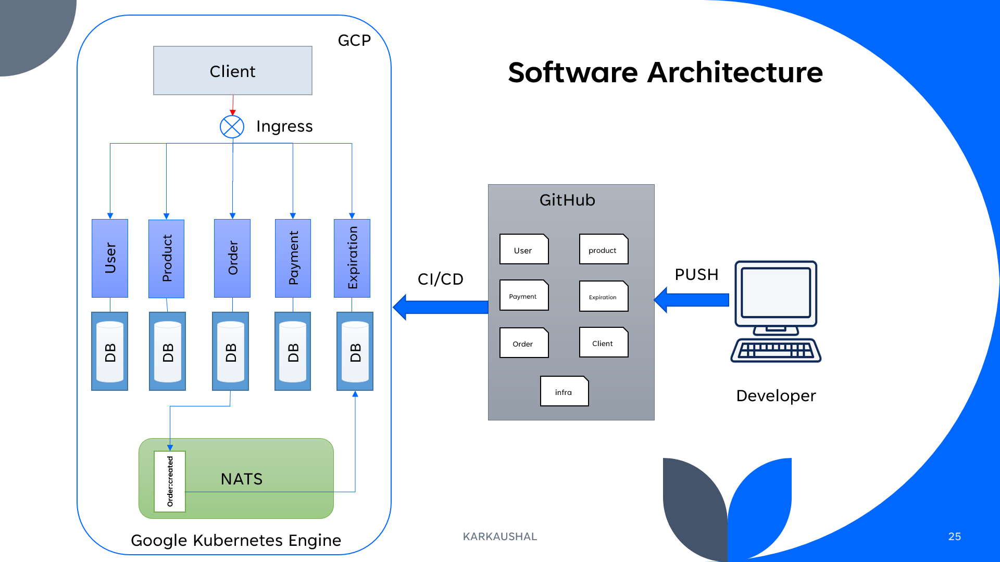
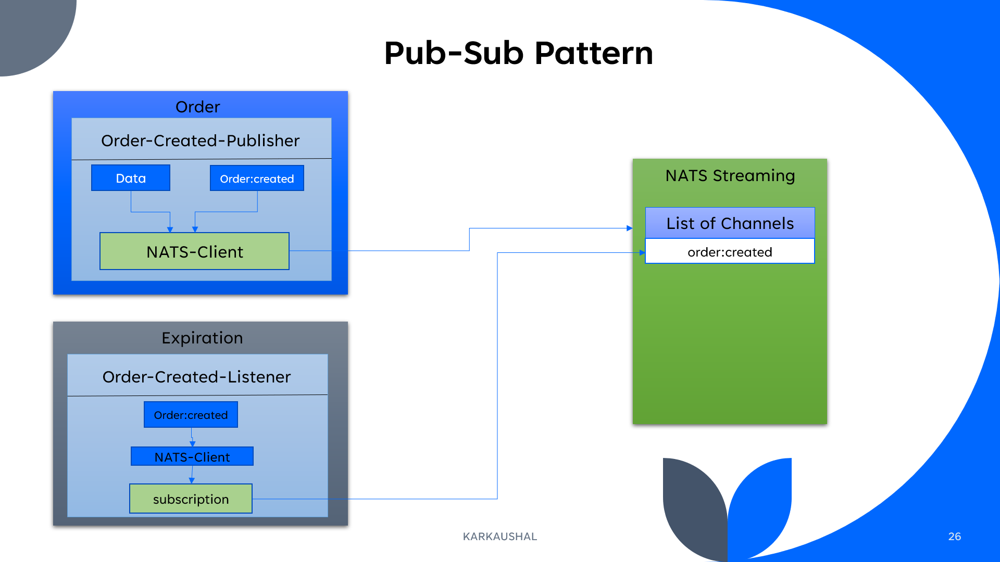
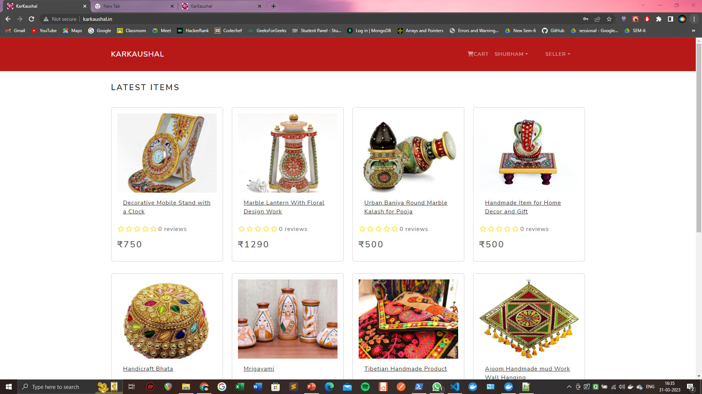
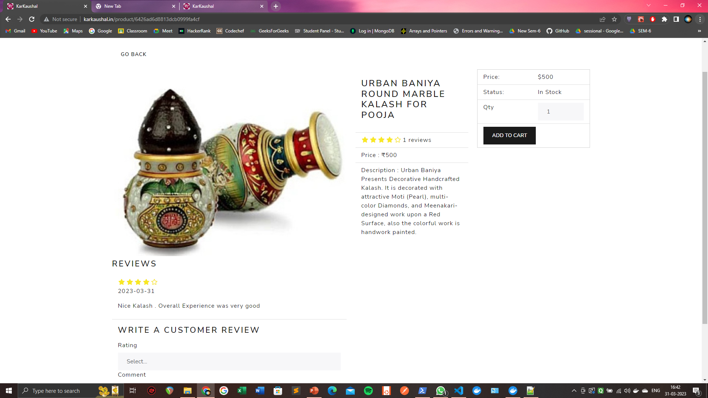
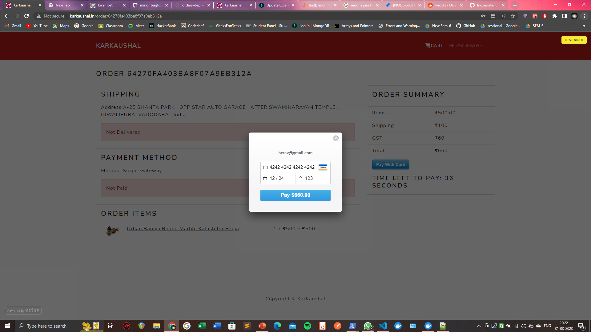
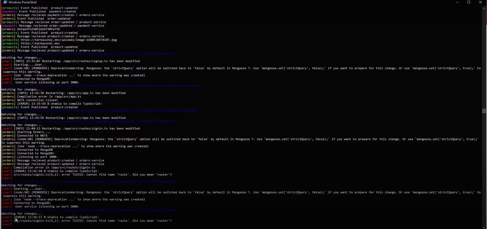
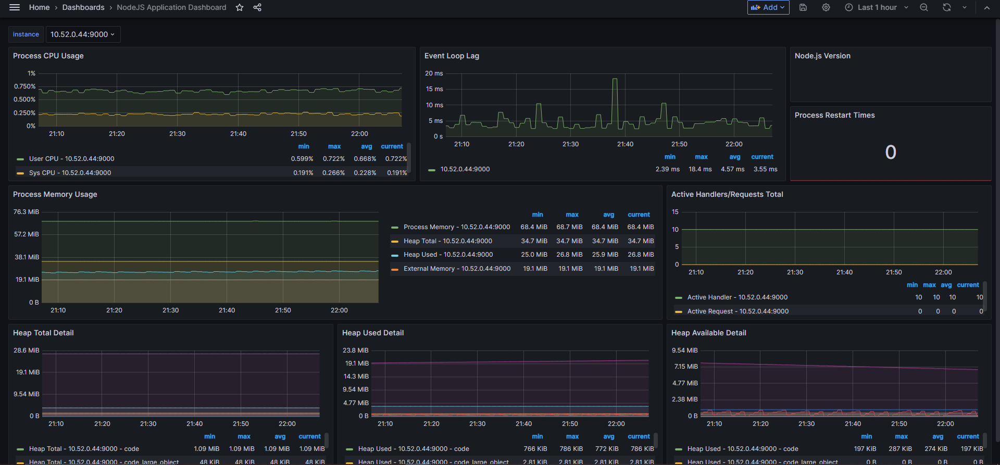
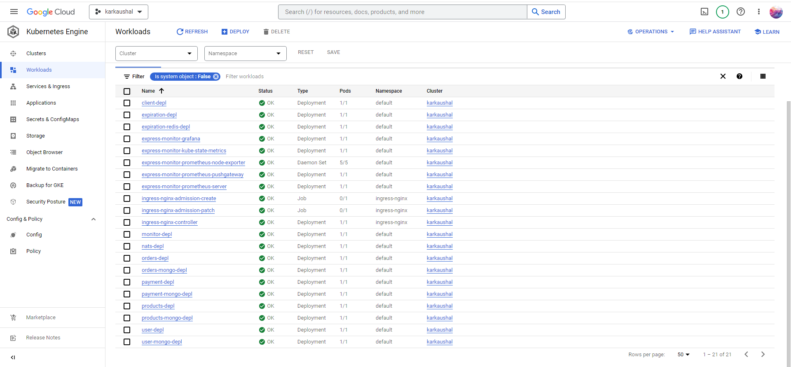
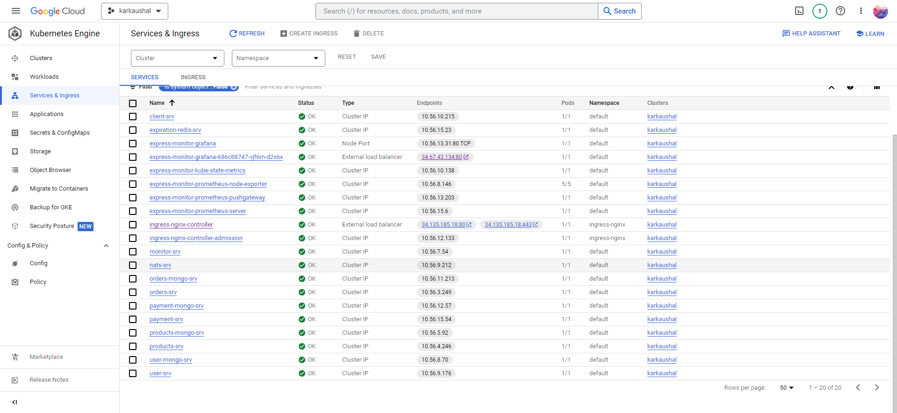

# Karkaushal


Karkaushal is an  e-commerce website for the people who sells handicraft product built with microservices architecture, developing on docker-desktop and Deployed on the Google Cloud Platform (Google Kuberenetes Engine) environment, integrated some CI/CD process with GitHub Action workflow.
## Demo

www.karkaushal.in ( *** FREE CREDITS OF GCP ARE OVER. RIP...........****)

## Video Demo
https://youtu.be/LIB7HfItkvE

## Software Architecture




## Installation

### Running on Docker Desktop

- Clone master branch on your computer
- Install node.js, skaffold, docker
- enable Kubernetes in docker desktop preferences
- sign up for a free account with $300 on the GCP and sign up for the docker hub account
- create an image by running a command in every folder that has a Dockerfile
``` javascript 
docker build -t <YOUR_ACCOUNT_NAME>/<YOUR_IMAGE_NAME> .
```
- push all images to the docker hub by running a command in every folder that has a Dockerfile
- install ingress-nginx and enable Kubernetes in Docker Desktop software

- (Windows) open host file at C:\Windows\System32\drivers\etc\hosts then edit by adding 127.0.0.1 karkaushal.dev and save as an admin

- create all kubernetes secrets
- run ```skaffold dev``` in this project root directory, and make sure to use the correct context before running the command
- open a web browser and enter your custom URL with https:// to see this project come to live!

### Setup Kubernetes Secret

#### JWT_KEY : --whatever you want (Preferable :10-12 random alphanumeric characters)--
``` javascript
kubectl create secret generic jwt-secret --from-literal=JWT_KEY=<YOUR SECRET>
```
#### STRIPE_KEY : 
``` javascript
kubectl create secret generic stripe-secret --from-literal=STRIPE_KEY=<YOUR STRIPE SECRET KEY>
```
## Screenshots

### UI




### Backend (Events)


### CI/CD




## Features

- Fully operated microservices-architecture website with user, product, order, payment, and expiration services completely separated
- Stored all user, product, order, and payment data in separate MongoDB collections
- Account setting dashboard for a customer to update profile information or see all orders
- Seller management dashboard with authority to add, edit, and delete a product
- Full-featured shopping cart (add, edit, and remove an item with ease!)
- Fully checkout process (login, add a shipping address, select payment method)
- Mark orders as a delivered option for the seller
- Make a product review and rating and calculate a new rating instantly
- Implement an Optimistic concurrency control concept with Mongoose to handle concurrency issues with event flow
- Created an expiration timer for payment completion during which the order gets reserved for a user
- Implemented Monitoring endpoints to measure api performance and server performance.

## Usage/Examples

### How to sign up for an account
 -  Browse to the signup page
 - Enter necessory details . (can be fictional as this is just a demo)

### How to purchase products
Pay with Stripe method (recommended)

- Using 4242 4242 4242 4242 for a card number
- Using any date (must be a later date from now) for MM/YY
- Using any number for CVC

### How to add new Products

- Signup as a seller
- Go to product page
- Create new product
- Update product details 

### How to access monitor endpoints
- Go to ```www.karkaushal.in/monitor/scrap``` to get the api monitoring information
- Go to ```www.karkaushal.in/monitor/dashboard``` to access the grafana dashboard


## Tech Stack

### Backend 

- NodeJS
- Typescript
- MongoDB
- ExpressJS

### Frontend 

- ReactJS
- Redux
- Javascript

### CI/CD 

- Docker
- Kubernetes
- Github Actions
- GCP (GKE)

### Monitoring
- Prometheus
- Grafana
